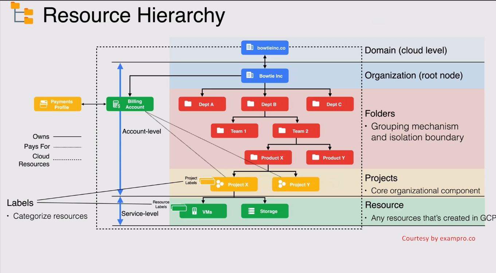

# Google Cloud Platform

## Google Cloud Design and Structure

### Google Cloud Fiber Network (At the time of writing notes)

- 28 regions
- 85 zones
- 146 edge location around the world

### 3 Main Pillar of GCP Design

- Provide Trust and Security
- Open Cloud - Open Source
- Analytics and Artificial Intelligence

### GCP Resource Hierarchy

#### Resource Hierarchy

- Domain
  - This is the primary identity of our organization.
  - Here we manage users in our organization. So Users, Identities, policies etc
    - These users or policies are linked to G suite or Cloud Identity accounts.
- Organization is associated with exactly one domain.
  - All controlled policies applied to Organization level are inherited by other entities and resources underneath it.
    - So any folders, projects and resources will get those policies that are applied from the organization layer.
- Organization to Project is considered as **Account-level** resource in GCP.
- Resources are considered as **Service-level** resource in GCP.

> **Note**: When an organization is created, an organization admin role is created.
> **Note**: Every Folder should have a parent node. Same goes to project



#### Cloud Billing

- Billing Account in GCP
  - Billing account is a cloud-level resource managed in the cloud console.
  - A billing account can be linked to one or more projects and pays for the resources created in GCP project.
  - A billing account is linked to Payment profile (Payment method etc) which is a Google-level resource.
  - Billing accounts can pay for other organizations too.
  - roles and permission can be granted to a billing account via IAM.
  - We can also have sub-accounts under master billing account.
  - Sub-accounts can be used for resellers.
  - Sub-accounts can group resources' charges in separate invoice and send back to master billing account for payment.
  - Sub-accounts are designed to allow for customer separation and management.
- Payment Profile
  - Payment profile is not only limited to Google Cloud but to other services as well. For example Google Ads etc.
  - It stores all information such that Name, Email address, and Contact.
  - It stores all payment method.
  - It controls who can view and receives invoices.
  - Payment Profile has two different types:
    - Individual
      - If we selected this profile for personal usage
      - We can control this profile and cannot add other users into it
    - Business
      - We can add other users to manage and control our payments.

> **Note**: If any project is not linked to billing account, it is limited to use paid google cloud services.
> **Note**: Once Payment profile type has been selected, it cannot be changed afterwards.

##### Cloud Billing - Demo

- Create, Edit, Close, Link, Unlink (to and from a project) and Close billing account
- Regular user needs **Project Owner** and **Billing Account Administrator** role in order to change the billing account for a project.

## Understanding Networking and Security in GCP

### 3-Layer Network that build Google Cloud

- VPC (Virtual Private Cloud)
- Subnet (Division of resources that gets private IP addresses)
- Router (Which traffic should go to where)

### IAM and Firewall rules

IAM and firewall rules allow you to set Granular policies to practice the "principle of least privilege"

- IAM
  - Who enable and protect his neighborhood and make sure everything is safe
- Firewall rule
  - Which traffic is allowed and which it not
  - We term this as Ingress and Egress traffic of our network

## Security in Google Cloud

- Trust and Security
- 6 Layers of Security in Trusted Cloud Infrastructure
  - Device
  - Internet
  - Identity
  - Storage
  - Deploy
  - Hardware
- Encryption at rest

### AAA Model - Control data flow

- Authentication
  - Who are you?
    - Password
    - MFA
    - Some authentication based things
- Authorization
  - What are you allowed to do?
    - Reading
    - Writing
- Accounting
  - What did you do?
    - Writing or deleting data but not includes viewing the data

- Resiliency
  - Make sure to keep things are running

### How Data Flow works?

- test
  
### Key Security Products/Features - AuthN - Authentication - Who are you?

- Identity
  - Humans use Google Workspace/Cloud Identity
  - Applications and Service use Service Accounts
- Identity Hierarchy
  - Google Groups
- Identity Management
  - Can use Google Cloud Directory Sync (GCDS) to pull from LDAP

### Key Security Products/Features - AuthZ - Authorization - Who can do what?

- Identity Hierarchy
  - Google Groups
- Resource Hierarchy
  - Organization
  - Folder
  - Project
- IAM
  - Permission
  - Roles
  - Bindings
- GCS ACLs (Google Cloud Storage Access Control List)
- Billing Management
- Networking structure and restrictions

### Key Security Products/Features - Acct - Accounting - What did you do?

- Audit / Activity Logs (Provided by Stackdriver)
- Billing Export
  - To BigQuery
  - To file (in GCS bucket)
    - JSON or CSV
- GCS Object Lifecycle Management

## Google Cloud APIs

- Google Cloud APIs allow to interact with Google cloud service programmatically through the console
- API management console is used to monitor requests, traffic, error, and latency on any enabled API.
- API Keys (OR API credentials) that we can get benefit from without using any service account or without any Google-managed user account
- We have API library that provides tons of services to interact with GCP service programmatically
- We can enable and create API credentials for any API

## Database Overview of Google Cloud

- Relational Database
  - Cloud SQL
  - Cloud Spanner
    - Enterprise-grade, globally-distributed, and strongly-consistent database
- Non-Relational Database
  - Cloud Bigtable -> NoSQL based database
  - Cloud Firestore
    - develop mobile, web and IoT application
  - Firebase
  - Memorystore
    - Fully managed Redis and Memcached database for millisecond data access

## Google Cloud Shell

- Cloud Shell runs on Linux server
  - Its a linu-based container
- It holds up to 5 GB of storage for us
- Comes with all of our favorite tools preinstalled like gcloud, MySql, Kubernetes, Docker, and much more...

### Google Cloud Shell Editor

- We can open Cloud Shell Editor in browser
- We can interact with any type of files right from the browser
- It comes with 5 gb of persistent disk volume.
  - `df -h` -> to check disk usage
- Cloud shell is globally distributed so Google provisions "Cloud Shell Editor" in the region which is nearest to us. That's avoiding any unnecessary latency.
- ```curl metadata/computeMetadata/v1/instance/zone```
  - to show in which zone our cloud shell instance is provisioned.
- It is based on Linux and comes with pre-installed tools like Google cloud SDK, bash, vim etc
  - It is pre-configured with many programming languages like Java, Python, Golang, etc
- We can customize our environment by executing the script when cloud shell editor boots up.
  - We need to save the file with this name .customize_environment
  - By default, this files doesn't exist, hence we need to create it ourself.
- edit <filename>
  - to open the file in cloud shell editor
- gcloud sdk commands
  - gcloud beta interactive
    - it will be able to bring up the interactive cloud shell
- Restart option in cloud shell
- Preference options for example, color theme, font, text size, etc
- Usage Quota
  - Cloud shell has weekly quota limit of 50 hours
  - If we reach to the limit, we have to wait before we can use Cloud shell again
- Web Preview
  - if we have any web page, we can use **Web Preview** to see how it works.

### Google Cloud SDK

Set of command-line tools that helps us to manage GCP resources through the terminal

- gcloud
- gsutil
- bq
- kubectl

These tools can be run in interactive mode as well as automated scripts.

#### Authorization to GCP

- User account
  - Single machine
  - An account for a user
- Service account
  - google account
  - Multiple machines
  - Can be used programmatically

#### Labels and Tags

Labels can be used as queryable annotations for resources, but can't be used to set conditions on policies. Tags provide a way to conditionally allow or deny policies based on whether a resource has a specific tag.

### Cloud Foundation Fabric

- https://github.com/GoogleCloudPlatform/cloud-foundation-fabric
- Fabric FAST

#### Set of commands to initialize, authorize, and setup

- gcloud init
  - Authorize access and perform the gcloud sdk setup
  - Used to work with multiple configurations
  - If we have two GCP accounts, we can execute gcloud init which will prompt to pick configurations or create a new one.
- gcloud auth login
  - Authorize the access only
  - Authorize our access for gcloud with user's google credentials and sets the current account as default
  - This is similar to Connect-AzAccount in Microsoft Azure
- gcloud auth list
  - List all credentialed account and identify the current active account
  - Ensures that you are authenticated with the right account by running gcloud auth list. The active account will be marked with an asterisk (*)
- gcloud auth revoke
  - It will remove credentials and and revoke access tokens from local computer
- gcloud config set account ACCOUNT
  - gcloud config set account abc@go.dev
- gcloud config
  - used to configure accounts and projects
- gcloud config list
  - it'll show the properties and active configuration
- gcloud config configurations list
- gcloud config configurations describe <configuration_name>
- gcloud components
  - Installable parts of gcloud sdk
  - install, update, delete sdk components that gives us more flexibility with different resources
  - We can refer "Components" in GCP as "Resource Provider" in Microsoft Azure
- gcloud components list
- gcloud info
  - Shows information about user log file, status and some properties
- gcloud services enable storage.googleapis.com
  - Enables Cloud Storage API
- gcloud services enable pubsub.googleapis.com
  - Enables PUB/SUB API

#### gcloud command format

gcloud [COMPONENT] [ENTITY] [OPERATION] [POSITIONAL_ARGUMENTS] [FLAGS]
gcloud   compute   instance   create     demo-instance-1       --zone=us-central1-a

#### gcloud interactive shell

It supports rich feature, for example

- Autocompletion
- Auto-Suggestion
- Inline help

In order to run gcloud interactive shell

- First we need to install the component using below command
  - gcloud components install beta
- Execute below command to start using gcloud interactive shell
  - gcloud beta interactive

## gcloud commands
