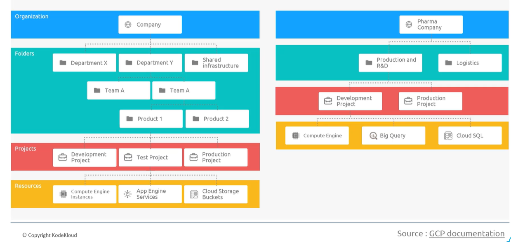

# Google Cloud Platform

## Region & Zones - Section 1

### Region

- Region is a geographical location (like US, Asia, Europe, Japan, etc) where gcp is hosting multiple zones.
- Zone is discrete data center connected with low latency.
- Region can have 3 or more zones. For example, us-west-1, us-west-2

### Select Region that nearest to customer

- GCP has a nice tool called *[Region Picker](https://googlecloudplatform.github.io/region-picker/)*.
  - We can pick the right region based on the incoming traffic from our application.
  - We can use this tool by selecting three different parameters.
    - Carbon footprint
    - Price
    - Latency

## Hybrid and Multi-Cloud Environment

### Hybrid Cloud

- A setup (of cloud) with the combination of private cloud (or on-prem data center) while leveraging public cloud like GCP.

### Multi-Cloud

- A setup of Multi-cloud in which we do work with Azure, AWS, and GCP. For example hosting 1 service in Azure and other services on GCP.

## GCP account and Resources - Section 2

### Use Kodekloud GCP environment

- To pass the Google Cloud Digital Leader certification, it is enough to use KodeKloud environment for GCP.
  
### Setup Personal GCP account

- GCP provides $300 free credit for the 90 days
- 20 service and free to use out of 92
- console.cloud.google.com -> GCP cloud console -> Similar to Azure Portal
- Make sure to disable the console account once trial period has expired or delete the details from console that were provided during setup personal account.

### GCP Dashboard

- Project number and Project ID is unique
- Project is similar to Resource Group in Microsoft Azure.

### GCP Resource Hierarchy

- Following is the resource hierarchy in GCP
  - Organization -> This is the root node -> We can also call this as '*company*'
  - Folder -> Here comes some departments of Shared stuff, for example, BI Team, SRE, OPS, etc
  - Project -> We can create one or many projects inside each above folder, for example, dev project, prod project etc
  - Resources -> These are the resources that we create inside the project. For example, VM, DB, and Firewall etc
- Sample Hierarchy in 'tree' format:
- acloudtechie.com -> Organization
  - BI Team -> Folder
    - prj-openai-weu-dev -> Project
      - vm-openai-linux-weu-dev -> Resource
      - aml-openai-weu-dev -> Resource
      - sqlsrv-openai-weu-dev -> Resource
      - bigquery-openai-weu-dve -> Resource
  - SRE Team -> Folder
    - prj-iac-weu-dev -> Project
      - jmpsrv-sre-weu-dev -> Resource
      - firewall-sre-weu-dev -> Resource
      - splunk-sre-weu-dev
- Graphical representation of above structure

