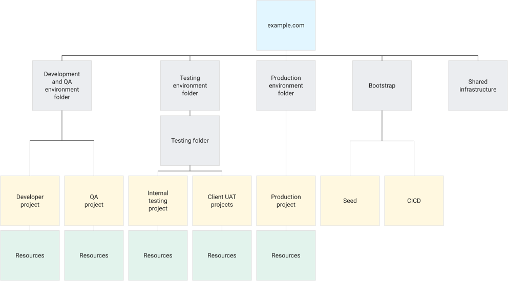
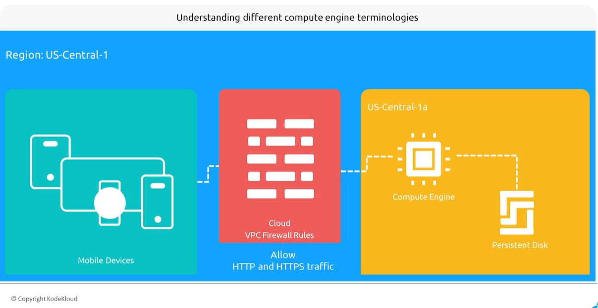
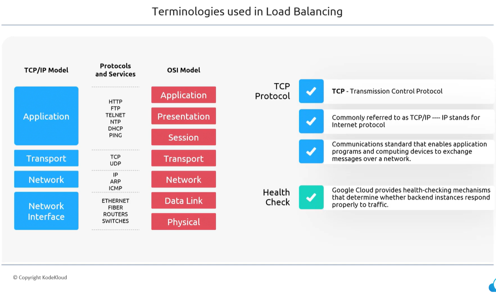
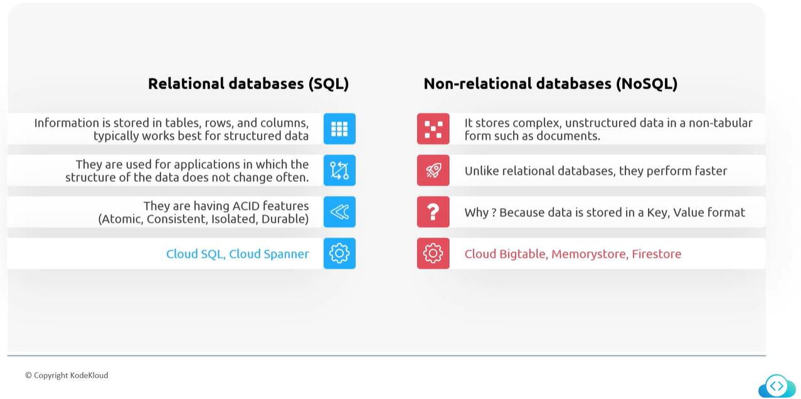
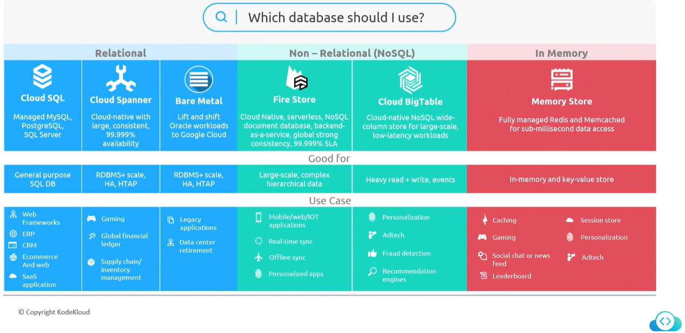

# Google Cloud Platform

## Region & Zones - Section 1

### Region

- Region is a geographical location (like US, Asia, Europe, Japan, etc) where gcp is hosting multiple zones.
- Zone is discrete data center connected with low latency.
- Region can have 3 or more zones. For example, us-west-1, us-west-2

### Select Region that nearest to customer

- GCP has a nice tool called *[Region Picker](https://googlecloudplatform.github.io/region-picker/)*.
  - We can pick the right region based on the incoming traffic from our application.
  - We can use this tool by selecting three different parameters.
    - Carbon footprint
    - Price
    - Latency

## Hybrid and Multi-Cloud Environment

### Hybrid Cloud

- A setup (of cloud) with the combination of private cloud (or on-prem data center) while leveraging public cloud like GCP.

### Multi-Cloud

- A setup of Multi-cloud in which we do work with Azure, AWS, and GCP. For example hosting 1 service in Azure and other services on GCP.

## GCP account and Resources - Section 2

### Use Kodekloud GCP environment

- To pass the Google Cloud Digital Leader certification, it is enough to use KodeKloud environment for GCP.
  
### Setup Personal GCP account

- GCP provides $300 free credit for the 90 days
- 20 service and free to use out of 92
- console.cloud.google.com -> GCP cloud console -> Similar to Azure Portal
- Make sure to disable the console account once trial period has expired or delete the details from console that were provided during setup personal account.

### GCP Dashboard

- Project number and Project ID is unique
- Project is similar to Resource Group in Microsoft Azure.

### GCP Resource Hierarchy

- Following is the resource hierarchy in GCP
  - Organization -> This is the root node -> We can also call this as '*company*'
  - Folder -> Here comes some departments of Shared stuff, for example, BI Team, SRE, OPS, etc
  - Project -> We can create one or many projects inside each above folder, for example, dev project, prod project etc
  - Resources -> These are the resources that we create inside the project. For example, VM, DB, and Firewall etc
- Sample Hierarchy in 'tree' format:
- acloudtechie.com -> Organization
  - BI Team -> Folder
    - prj-openai-weu-dev -> Project
      - vm-openai-linux-weu-dev -> Resource
      - aml-openai-weu-dev -> Resource
      - sqlsrv-openai-weu-dev -> Resource
      - bigquery-openai-weu-dve -> Resource
  - SRE Team -> Folder
    - prj-iac-weu-dev -> Project
      - jmpsrv-sre-weu-dev -> Resource
      - firewall-sre-weu-dev -> Resource
      - splunk-sre-weu-dev
- Graphical representation of above structure

<blockquote class="note">

**Note:** Resources can interact with each other even they are in different projects.

</blockquote>

#### Hierarchy based on application environment

- Following hierarchy is based on application environment.

Source: [GCP Documentation](https://cloud.google.com/architecture/landing-zones/decide-resource-hierarchy)

### Billing in GCP

- Personal account holder billed by the end of month.
- Organization billed by the end of year (or as per the agreement)

## Compute in GCP

- There are variety of options (services) available that provides compute services in GCP. Following are the some of them:
  - Compute Engine -> It comes under IaaS (Servers) - Virtual Machine in Azure
  - Cloud Functions -> It comes under IaaS (Servers) - Azure Function - App Service
  - Google Kubernetes Engine -> It comes under IaaS (Servers) - Azure Kubernetes Service
  - Cloud Run -> It comes under IaaS (Servers)
  - App Engine - App Service (App service plan)
  - Workflow - Logic App
  - Container Optimized OS

### Understanding Compute, Persistent Disk, and Firewall

- To understand the aforementioned, look at these things
  - Application (website)
    - Compute -> is a virtual machine that can run our application
  - Application (website) images/content
    - Persistent -> is a storage where we can store images and all content.
  - Client
    - Mobile and Browser etc -> that will use our application
  - Communication and Networking will be secure through HTTP/S
    - Cloud VPC Firewall -> to allow only HTTPS traffic
  - Location (region) where the clients will access the application from
    - Zone (in region) -> the data center which is nearest to client to minimize the latency.
- Graphical representation

Source: Kodekloud

### Compute demo points

<blockquote class="info">

**Info:** We need to enable the "Compute Engine API" for the first time we create compute instance. This is similar to *Resource Provider* in Microsoft Azure.

</blockquote>

### Summary of compute, persistent disk, and firewall

#### Compute

- It is nothing but a Virtual machine
- It comes with different sizes
  - Scale-out workloads (T2D)
  - General purpose workloads (E2, N2, N2D, N1)
  - Ulta-high memory (M2, M1)
  - Compute-intensive workloads (C2, C2D)
  - ...etc
- Pricing
  - Pricing is based on per-second usage of the machine types.
- Operating systems
  - Public Images are available
    - Windows
    - Linux -> Ubuntu, Debian, CentOS, etc
- Regardless of the region where we created our VM, default time on all GCP VM is UTC.
- Solo tenant node is a physical Compute Engine Server dedicated to hosting only our project's VM instances.

#### Persistent Disk

- To host our source (or application) code to run our application, we need persistent disk.
- Persistent Disk have different types
  - HDD
  - SSD etc
- We can increase the size of disk according to our needs
- We can attach the disk to our instance and de-attach as well

#### VPC Firewall Rules

- To access the compute instance either via SSH or browsing the application, we need set of rules that we define in VPC firewall rules to allow or deny the traffic.
- This VPC is the guardian for that prevent unauthorized access to our systems behind these vpc.
- We can create following rules as an example
  - SSH to compute instance using port 22
  - HTTPS to web application using port 443
  - ...etc

There are three kinds of roles in Cloud IAM:

- Primitive roles
  - Roles existing in GCP before Cloud IAM was introduced and that continue to work: Owner, Editor, and Viewer
- Predefined roles - Roles managed by GCP granting granular access control to specific services.
- Custom roles - Roles created to tailor permissions to the needs of an organization when predefined roles cannot meet them.

### Scaling compute with instance group and load balancer

#### Instance Group

- Manages as single entity
  - We can monitor all instances under one group as well as perform scalability
- Contains two types of instances
  - Managed instances
    - Two or more identical Virtual machines
    - auto scaling
    - automatic updates
    - High availability
    - Scalability
    - Self-healing
  - Un-managed instances
    - Un-identical virtual machines OR
    - Multiple different virtual machine that are spin up in same instance group
    - We have to manage the load balancing our-selves
- Provides scalability
- Provides High availability
- Has feature of 'Self-healing' that makes sure the system is always available in case of any instance is down in an instance group
- Works similar to Virtual machine scale set in Azure

#### Instance Template

- In this instance template we only have to define the properties of virtual machine one time and then we can reuse it whenever we want with new instance group.
  - By properties I meant by OS type, Size of VM, networking rule etc

#### Demo - Instance group

- Productive auto-scaling
  - It works based on an auto scaling policy. For example in past when the CPU was greater than 60%, it added an instance so this time it will predict the same and perform auto-scaling.
- Instances in instance group provides resiliency which means:
  - If we have only one instance and we delete that instance then it will delete the instance and create a new one because we setup an instance group with minimum one instances, hence it provides resiliency.

#### Demo - Load Balancer

- Load balancer is part of "Network Service". Similarly
  - VPC Firewall Rule
- Type of Load Balancer in GCP
  - HTTPS Load Balancer
    - It uses layer 7 protocols
  - TCP Load Balancer
    - Layer 4 load balancer
  - UDP Load Balancer
    - Layer 4 load balancer
- Different kinds of Load Balancer
  - Internet-Facing that gets an IP address and available on public internet.
  - Internal - That communicates and serves the requests coming from internal network.
- Global or Regional
- Health Check
  - It is Mandatory option that we need to configure while setting up load balancer
  - It performs the health check to backend server to see if it's up and running.

##### Some common terms used in Load balancer demo

- TCP - Transmission Control Protocol
  - Refers to as TCP/IP protocol - IP stands for Internet Protocol
  - Communication standards that enables application and computing devices to exchange message over the network.
- UDP
- Layer 7 Load Balancer - HTTP/S Load Balancer
- Layer 4 Load Balancer - TCP/UDP Load Balancer

<blockquote class="info">

**Info:** A very nice and simple explanation shown by Kodekloud is as below

</blockquote>

Source: Kodekloud

### Some useful commands

- We can query the quota limit by executing this command
  - gcloud compute project-info describe --project myProject

### GCP VS Azure - Services

- Cloud Armor - WAF (Web Application Firewall)

### Use case to Hands-on GCP

#### Minimum Requirements

- An application should be
  - Scalable
  - Highly Available
  - Deployed through "Easy deployment"
- Easy Deployment
  - Startup script OR Post deployment script
    - apt get update
    - apt -y install apache2
    - echo "Simple server running on $(hostname)" > /var/www/html/index.html
- If startup script is failed, the virtual machine will not be failed.

## Database

### Different kinds of Databases in GCP

- Cloud SQL
  - Works with
    - SQL Server
    - MySQL Server
    - PostGreSQL Server
- Cloud Spanner
  - Cloud-Native
  - Provides 99.999% uptime
  - Process more than 2 billion request per second at peak
  - Suitable for users using Oracle and DynamoDB
- Alloy DB for PostgreSQL
  - Fully managed, POSTGRESQL-compatible database
- Cloud Bigtable
  - Fully managed NoSQL Database
  - Casandra

#### SQL and NoSQL Database

- Relational Database (SQL)
  - Data stored in tabular format
  - Some systems that are built and used SQL kind of databases:
    - Ticketing System
    - Ordering System
  - SQL Databases that are used in GCP
    - Cloud SQL
    - Cloud Spanner
- Non-Relational Database (NoSQL)
  - Data stored in document format.
    - Data stored key-value pair format
  - It does not contain any table for that
  - If we want to pick the restaurant where we ate the food from, we can pick the list based on user id (as unique key) and values from NoSQL db.
  - NoSQL Databases that are used in GCP
    - Cloud Bigtable
    - Memorystore
    - Firestore
- Difference between SQL and NoSQL Database

Source: Kodekloud

#### Which Database Should I use?

<blockquote class="info">

**Info:** This Diagram shows the databases based on use-cases

</blockquote>

Source: Kodekloud

#### Demo - Database

- Enable SQL Admin API
  - It will require when connecting to db first time
- Multi-region data replication
  - Database replication can be done outside the region
- Database backup is setup by default
- Maintenance Window
- Delete Protection
  - We need to disable it before deleting the database

## Object Storage

### Storage types

- Volumes
- Database
  - Cloud SQL
  - Alloy DB
- Un-structured data
  - Google Cloud Storage

#### Google Cloud storage (Object storage in GCP)

- Cloud storage sometimes refers to as Bucket.
- Pay what you use
  - We only pay for what we use in Object Storage in GCP. For example if we have 20 gigabyte of data, we only have to pay for that.
- Turbo replication
  - We can enable the turbo replication which replicates 100% of data between regions in 15 or less mins.
- Durability of data is 99.999999%
- Retrieval of data is very often
- Protection tools
  - Your data is always protected with Cloud Storage but you can also choose from these additional data protection options to prevent data loss.
  - None
  - Object versioning
  - Retention policy

<blockquote class="note">

**Note:** Note that object versioning and retention policies cannot be used together.

</blockquote>

#### Use Case - GCP Cloud storage

- Rich media storage and delivery
  - Where user have to upload image and videos etc
- Big data analytics
- Internet of things
- Backup and archiving

#### Demo - GCP storage bucket

- Bucket should be globally unique
- Storage class
- Expose bucket to public internet
  - This should not be enable
  - By default this options is "checked"

#### Storage class - GCP Storage

- Why we use it?
  - The data in bucket is 1 year old
  - We are still paying for the data even it is not being used
  - We cannot simply delete the data as it is required for auditing purpose
  - Here comes storage class
- What is Storage class?
  - Storage class is a way in which we can chose a right kind of configuration for our bucket
  - It helps us to optimize the cost for the data
  - Storage class has to be selected based on our workload.
- Types of Storage class
  - Auto-class
    - Automatically transitions each object to hotter or colder storage based on object-level activity, to optimize for cost and latency. Recommended if usage frequency may be unpredictable. Can be changed to a default class at any time.
  - Set a Default class
    - We can select default class using this option
  - Standard storage
  - Near-line storage
    - 30 day minimum storage duration
  - Cold-line storage
    - 90 day minimum storage duration
  - Archive storage
    - 365 day minimum storage duration

<blockquote class="note">

**Note:** There is no cost once we archive the data in "Archive storage class" bucket. But reviewing the data again from archive is very costly. So make sure to select the class based on data usage.

</blockquote>

## Building APIs in GCP

- Microservice architecture is nothing but, they are independent resources built by different teams communicating with each other.
- API - Application User Interface
- Which service in GCP we do have available to build APIs?
- Can we scale APIs to let's say 100 easily?

### Apigee in GCP

- Apigee (API management) is a tool in GCP that can help us to build APIs.
- Apigee Management System
  - All our client (mobile app, pos system, web etc) will be using Apigee Edge which will connect to backend systems. For example Database, etc
- AI-Powerd API monitoring
- The tool is developer-friendly
- Apigee is hybrid solution. We only have to select where to host our APIs.

## Big Data and AI with GCP

### 4 v's of Big Data

- 1st V -> Volume of data
- 2nd V -> Velocity of data
  - how fast we are generating the data
- 3rd V -> Variety of data
  - Data is generally one of three types: structured, un-structured, semi-structured
- 4th V -> Veracity of data
  - The veracity of big data denotes the trustworthiness of the data. Is the data accurate and high-quality? Can we use that data right away?
  - In simple words about Veracity
    - The huge amount of structured or un-structured data volume that we generated quickly is useful for organization?

### 4 Steps of handling big data in GCP

- Collection of data
  - Batch
  - Real-time
  - Near real-time
- Processing the data
  - Spark
  - Big data tool that can process large amount of data
- Analytics on Data
  - Once we have done the processing od the given, we have to now analyze this data and take business decision
- AI and Machine Learning
- What are the GCP services that can help us achieve all above steps?

### Usecase for Big Data

- We have a company that sells something to customer
- We have a warehouse where we keep the stuff
- Now we have an order from the customer
- To process the order, we will pack the product and ship to customer
- As soon as the product leaves the warehouse
  - we can take the data using IOT (internet of things) and ingest the data in Pub/Sub topic (A streaming service in GCP that can stream real-time information)
  - From Pub/Sub, this data can be stored in Cloud Storage (Object storage or Bucket) as an object
  - Once we have our data stored, we can perform analysis on that data.
    - To analysis the data we have BigQuery (warehouse) and Dataproc in which we can do analytics on data.
  - Last is Vertex AI which is used to train, model and deploy the data.

### Core services being used for Big Data and AI

- Pub/Sub               -> Ingest
  - Use for real-time information
  - can be used to ingest the data into Big Query, data lake (can be cloud storage bucket), or operational databases (can be Cloud sql)
- Cloud Storage         -> Store
  - Lower-cost storage option
  - Can act as Data warehouse
  - Connect further to Big Query, Dataproc to process the data.
- Big Query / Dataproc  -> Analytics
  - Use for data processing
  - Dataproc is a fully managed and highly scalable service for running Apache Spark, 30+ open-source tools and frameworks.
    - Used for data lake modernization, ETL
    - Pay as you go model
    - No license required
- Vertex AI             -> Train and Deploy
  - Use to build and run AI model
  - Data engineers can build, train, deploy, and use the data using Vertex AI.
  - End-to-End machine learning model deployment
  - Options to use Tensorflow, Scikit ML libraries

### Demo - PUB/SUB

- Topic
  - When the data gets ingested, it is first stored in Topic.
  - We can consider Topic as a temporary storage
  - OR a "Stream of information that is getting ingested".
  - Data retention is by default set to 7 days (minimum) but we can increase the days
  - Max days is 30 as we cannot keep the topic as permanent data.
- Subscription
  - From the Topic, we can read this information via Subscription.
  - The subscription connects to a Topic and extracts the required information.
  - From Subscription, we can further push it to Cloud storage, Cloud SQL and other services in GCP.
- Snapshot
  - Once the topic is deleted, the data cannot be retrieved. If the information that is present in this topic is important, we can enable the snapshot option for this topic.

### Demo - BigQuery

- Big Query pricing is based on "Amount of data scanned during the query"
- We can save and share the Query
- When we upload the data, scheme can be auto-detected based on the data in file.
  - Table info
    - Provides information about the table
  - Storage info
    - Provides information the data, for example Number of rows, size etc
- BI Engine
  - BI engine saves our cost
  - We can create the reservation for BI Engine
- Looker is best tool to find insights and visualize of the data stored in Big Query?
